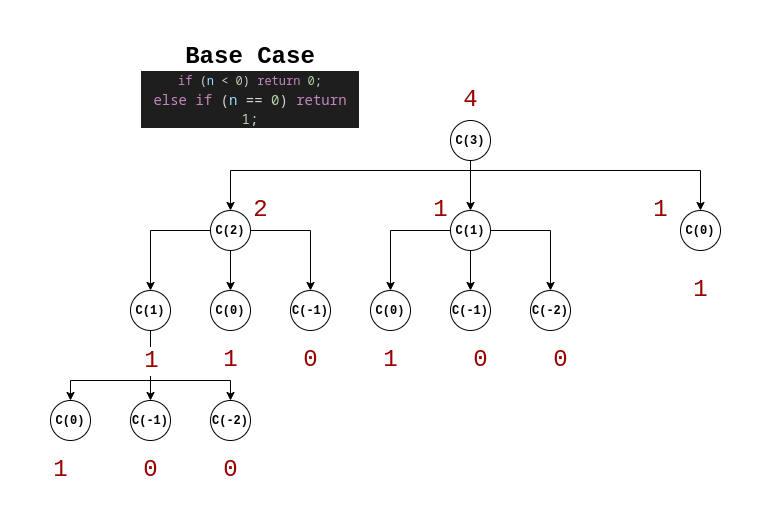

### Chapter 8| Recursion and Dynamic Programming.
#### cracking the coding interview book - Interview Questions - Triple Step. 

Problem statement:

8.1 Triple Step: A child is running up a staircase with n steps and can hop either 1 step, 2 steps, or 3
steps at a time. Implement a method to count how many possible ways the child can run up the
stairs.


- Brute Force Solution:


```c++
#include "bits/stdc++.h"

using namespace std;
```


```c++
int solve(int n)
{
  if (n < 0) return 0;
  else if (n == 0) return 1;
  return solve(n - 1) + solve(n - 2) + solve(n - 3);
}
```


```c++
int n;
cin >> n;
```

    3


```c++
solve(n)
```


    4


Example: 
Input: n = 3
Output: 4
Explanation: 
possible ways:

1. 3 - (1 + 1 + 1).
2. 3 - (1 + 2).
2. 3 - (2 + 1).
4. 3 - (3).



- Memoization Solution:

     - if we have seen value of n before, return the cached value.
     - else compute a fresh value.


```c++
#include "bits/stdc++.h"

using namespace std;
```


```c++
map<int, int> vis;
```


```c++
int solvememo(int n)
{

  if (n < 0)
    return 0;
  else if (n == 0)
    return 1;
  else if (vis[n])
  {
    return vis[n];
  }
  else
  {
    vis[n] = solvememo(n - 1) + solvememo(n - 2) + solvememo(n - 3);
    return vis[n];
  }
}
```


```c++
int n;
cin >> n;
```

    8


```c++
solvememo(n)
```


    81
